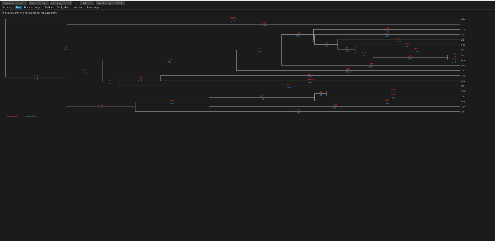
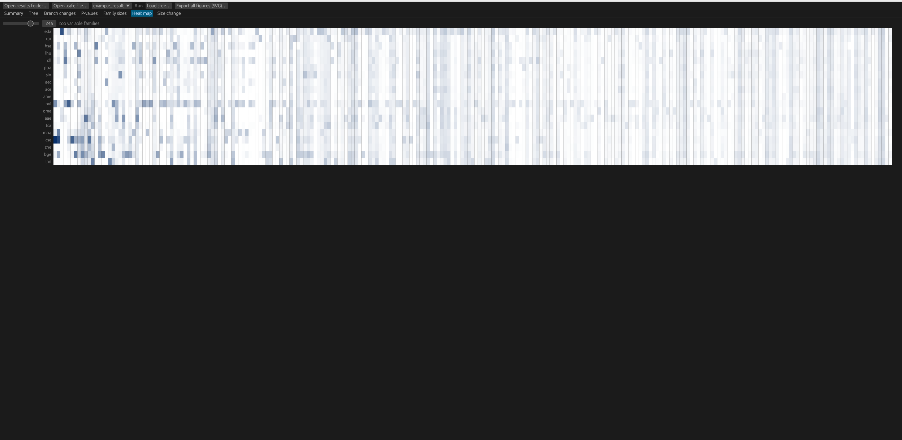
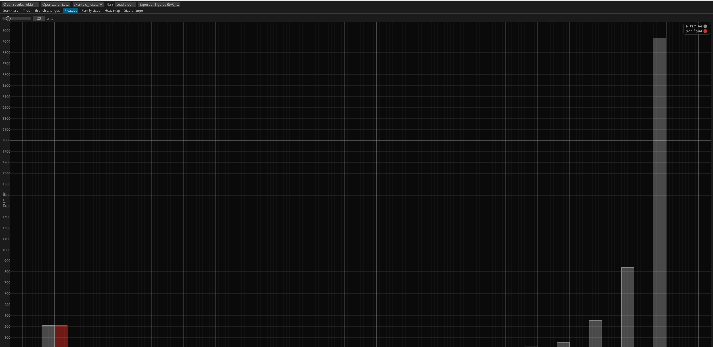
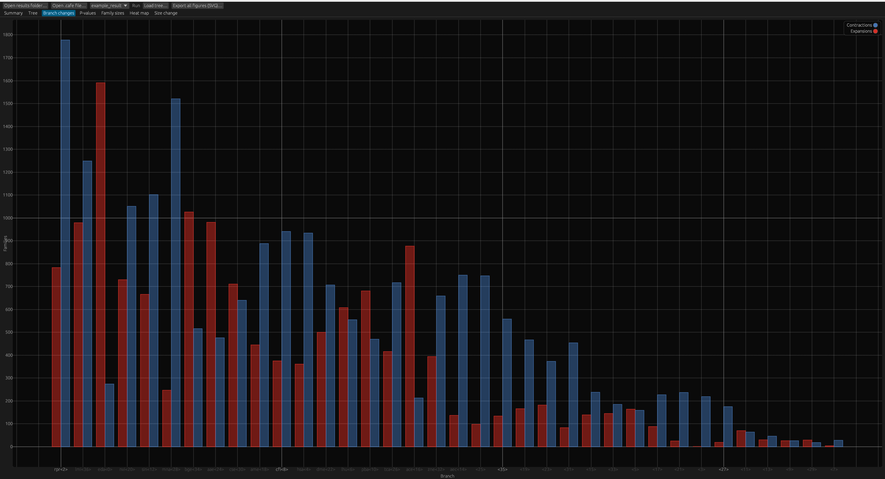

# genef

Desktop GUI (Rust, egui) for exploring [CAFE5](https://github.com/hahnlab/CAFE5) gene family evolution results. Point it at a CAFE5 output folder and it plots every standard figure.

## Run

    cargo run --release

Click **Open results folder…** (CAFE5 output) or **Open .cafe file…** (a single CAFE5 `*_report.cafe` file). Files are found by suffix; if the folder holds several runs
(`Base_*`, `Gamma_*`) pick one with the **Run** box.

| File used | Figure |
|---|---|
| `*_asr.tre` (or any Newick via *Load tree…*) | Annotated tree: +expansions / −contractions per branch |
| `*_clade_results.txt` | Grouped bars of expansions/contractions per branch |
| `*_family_results.txt` | P-value histogram (all vs significant), top families table |
| `*_count.tab` | Family-size distribution per species, heat map of most variable families |
| `*_change.tab` | Distribution of size change per branch |
| `*_results.txt` | Model summary (lambda, likelihood) |
| `*_report.cafe` / `*.cafe` | CAFE5 report: tree, lambda, per-branch expansions/decreases, sizes and p-values of the significant families. Used only when the per-file output above is absent |

**Export all figures (SVG)…** writes tree, branch, p-value, size, heat map and change plots as SVG.

**Legend.** The heat map has a 0-to-max colour scale; the tree shows `+n` (red) and `-n` (blue) per branch.

## Headless export (no window)

    cargo run --release --example export_svg -- <results_dir> <prefix> <out_dir>
    cargo run --release --example export_svg -- example_data Base out

`example_data/` holds a 40-family excerpt of a **real CAFE5 v1.1 run** (12 primates, Base model: `Base_*` files including `Base_report.cafe`) and a 50-family excerpt of a second real report (`example_result_small.cafe`).

## Test

    cargo test        # 20 unit tests: parsers, layout, binning, heat map, SVG, loader, export

Requires Rust >= 1.82 (eframe 0.29 / current dependency versions).

## Known limitations

- `_report.cafe`: CAFE5 lists only the families below its `--pvalue` cut-off, so only those appear (the app warns). Family p < 0.05
  is flagged significant because the threshold is not stored. Per-branch Viterbi p-values are not plotted yet.
- Tested on real CAFE5 v1.1 Base-model output (per-file and report agree cell for cell). Gamma / multi-lambda runs untested.
- Very short branches (a few Myr) crowd their +/- labels; use the cladogram view or the exported SVG to move them.
- Newick: quoted labels (`'a b'`) are not supported; only the first tree of a multi-tree Nexus file is read
  (topology is the same for every family in `*_asr.tre`; annotations come from `*_clade_results.txt`).
- Heat map colour scale is linear on the global maximum, so one very large family can wash out the rest.
- Significance is CAFE5's own flag (`y`/`n`); no additional multiple-testing correction is applied.

Gaurav Sablok \
gsablok@proton.me
